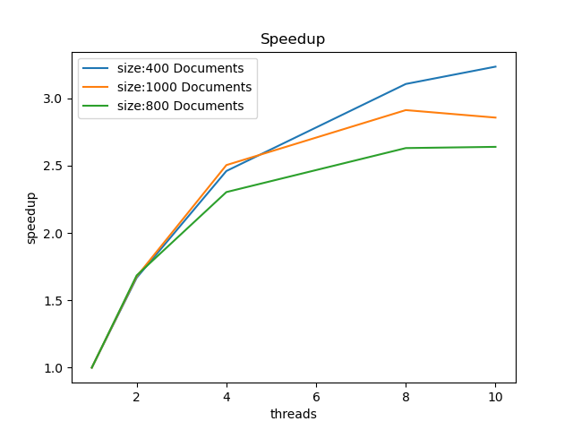

# Project 3: Parallel Natural Language Processing

## Overview

A  model can be used to create a feature vector that describes a document. It simply counts how many times each word occurs in a document. For example, the document "John likes to watch movies. Mary likes movies too." has the vector ```{"John":1,"likes":2,"to":1,"watch":1,"movies":2,"Mary":1,"too":1}```.

 takes this one step further. It is a slightly more sophisticated statistic that can be used to represent how important certain words are to a document. Instead of simply counting how many times a word appears, we include another term called *inverse document frequency*. It accounts for what *percentage of documents in a collection of documents* a word appears. This way common words like 'the' and 'an' get a small weight since they appear in every document, but rarer words get a bigger weight since they are more likely to be important. To get the tf-idf for a word in a document, we simply multiply the term frequency (same as the bag-of-words, just count how many times a word appears in a document) by the inverse document frequency.

I want to create the tf-idf vector for many documents as quickly as possible. For each document, the result will be a vector representing the tf-idfs of the .

We can use these vectors for tons of things, like finding the  between two feature vectors as a measure of similarity between their two documents, summing the tf-idf values of the words in a search query to find which documents are most relevant to that query, or using it as an input for some machine learning model.

## Data 

I pulled 1000 books from  for the dataset. I made a simple bash script ```books/get_books.sh``` that calls wget a bunch of times to download the books. Note there are two commonly used url formats, so I just try both for each book_id.

While getting a tf-idf vector as quickly as possible might not be super important for books that are decades old, one could easily imagine applying this very same technique to tweets that are coming in real time, scraping news stories from major news orgs, or many other uses cases when speed is paramount.

## Parallelization

This problem is embarassingly parallel. Each book can be assigned to a goroutine that calculates its bag-of-words vector (term frequencies) completely independently of every other book, so this makes a perfect use case for parallel programming and we should see some nice speedup.

After calculating the term frequencies, we need to calculate the inverse document frequency for each of our 10000 words. We can do this in parallel as well. 

Finally, we calculate the tf-idf for each word in each document by multiplying the term frequency of that word in that document by the inverse document frequency of that word. This too can be done in parallel!

## How to run the program

0. cd into the proj3 directory

1. cd into the books directory, then call ``` bash ./get_books.sh``` to download the books. You can interrupt this at any time with control-C if you don't wanna sit around waiting for all 1000 books to download.

2. cd back into the proj3 directory, then call ```go run main.go <n_threads> <n_books> <save_results>```
  * n_threads: the number of worker goroutines to create. if this is equal to 1, it runs the serial version
  * n_books: how many of our 1000 books to run the process on (note: ensure that n_books / n_threads is an integer)
  * save_reults: 0 if you don't want to save results, 1 if you want to save results into the tfidf folder
  * NOTE: On the CS cluster, I did have to call ```module load golang/1.16.2``` before running ```main.go```

3. if you want to produce your own speedup graph, call ```python timings.py```

## Performance Discussion



I ran these benchmarks on my 2019 MacBook Pro with the following specs

* Processor: 2.6 GHz 6-Core Intel Core i7
* RAM: 16 GB 2667 MHz DDR4

The number of documents doesn't seem to have a huge impact on the speedup itself. However, the speedup flattens out after 6 threads, which is equal to the number of cores on my machine, which makes sense. Even though hyperthreading is enabled, it seems to not have an effect here.

One possible thing is limiting the performance is the fact that we have to wait for the groups of threads to finish after the 3 main steps: 1. Calculating Term Frequencies 2. Calculating Inverse Document Frequencies 3. Calculating TF-IDFs. Unfortunately there is no way around this since each step depends on the result of the previous step. 

Also, ideally each worker will be assigned a similar amount of work, but I didn't do anything to ensure that this is the case. One worker might get a bunch of huge books and another might get a bunch of small books and finish well before the other thread and just have to wait around doing nothing. Something like assigning the books to the workers one by one, or implementing some work balancing would definitely be worth implementing if we really needed more performance.

In conclusion, parallel programming was able to provide a nice speeedup. This repository provides a great base for future projects in the NLP space.